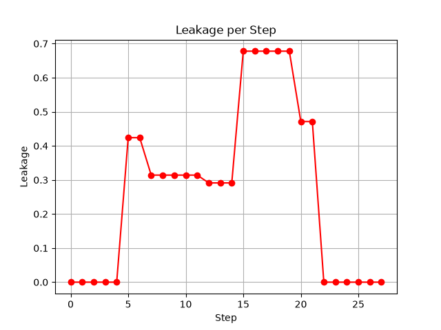

物理量子回路の実行
==================

## 物理量子回路の実行

### トランスパイル後の量子回路を実行

トランスパイルできるようになったら、次にその回路を実行したくなります。`EoqEngine`クラスを使って実行のシミュレーションをすることができます。

いま、以下のように、量子回路とデバイスのトポロジーを作成します。

```python
from qiskit import QuantumCircuit
from eoqrid import DotArchitecture, EoqEngine

qc = QuantumCircuit(2)
qc.h(0)
qc.cx(0, 1)

arch = DotArchitecture()
arch.add_edge(0, 1)
arch.add_edge(1, 2)
arch.add_edge(1, 4)
arch.add_edge(3, 4)
arch.add_edge(4, 5)
```
この量子回路をトランスパイルします。`optimization_level`は適当に2としておきます。

```python
eoq = EoqEngine(arch)
qc_phys = eoq.transpile(qc, optimization_level=2)
```
これで、物理量子回路`qc_phys`が得られました。実行するには、`EoqEngine`クラスの`execute`メソッドを使います。返却値は`eoqrid`の`Result`クラスであり、その中の属性値`qstate`(`eoqrid`の`QuantumState`クラス)に結果の量子状態が保持されます。

```python
res = eoq.execute(qc_phys)
```
これで変数`res`に結果が格納されました。`res`の属性値`qstate`に対して`draw`メソッドを実行することで、結果の状態ベクトルを表示することができます。

```python
print("== quantum state (logical) ==")
res.qstate.draw()
```
実行すると、

```
== quantum state (logical) ==
c[00] = +0.7071+0.0000*i : 0.5000 |++++++
c[01] = -0.0000-0.0000*i : 0.0000 |
c[10] = +0.0000-0.0000*i : 0.0000 |
c[11] = +0.7071-0.0000*i : 0.5000 |++++++
```
こんな形で表示されます。一番右側の`+`の羅列は状態ベクトルの各複素成分の絶対値の2乗の大きさを表す棒グラフと思ってください。その左の0.5000とか0.000と記載されているのはその値です。これで、入力した量子回路を実行した後の論理量子状態ベクトルが確認できます。

物理的な6量子ビット状態のベクトルも表示することができます。`draw`メソッドのオプション`mode`に文字列"physical"を指定すれば良いです(ちなみに、`mode`のデフォルト値は"logical"です。先ほどは`draw`に何もオプション指定しなかったので論理量子状態が表示されました)。6量子ビットの状態なのでベクトルの次元は64になり表示が長くなって見づらいです。実際にやってみるとわかりますが中身はほとんどゼロなので、`draw`メソッドの`ignore_zeros`オプション(ゼロ以外の成分のみ表示するオプション)を`True`に設定して、表示を短くしてみます。

```python
print("== quantum state (physical) ==")
res.qstate.draw(mode='physical', ignore_zeros=True)
```
出力は以下のようになります。

```
== quantum state (physical) ==
c[001001] = -0.3333-0.3333*i : 0.2222 |+++
c[001010] = +0.1667+0.1667*i : 0.0556 |++
c[001100] = +0.1667+0.1667*i : 0.0556 |++
c[010001] = +0.1667+0.1667*i : 0.0556 |++
c[010010] = -0.3333-0.3333*i : 0.2222 |+++
c[010100] = +0.1667+0.1667*i : 0.0556 |++
c[100001] = +0.1667+0.1667*i : 0.0556 |++
c[100010] = +0.1667+0.1667*i : 0.0556 |++
c[100100] = -0.3333-0.3333*i : 0.2222 |+++
```

ここで、注意事項を一つ。`eoqrid`での状態ベクトルの配列順は`qiskit`とは異なります。例えば、2量子ビットの状態ベクトルの成分は、|00>,|01>,|10>,|11>に対する確率振幅の配列なのですが、ケット内の一番左のビットが0番目の量子ビットを表しており、`qiskit`とは逆順になります。

表示ではなく、状態ベクトルそのもののnumpy配列を取得したい場合は、各々属性値`logical_qstate`および`physical_qstate`で取得することができます。

```python
data_logical = res.qstate.logical_qstate
data_physical = res.qstate.physical_qstate
```

以上、量子回路に測定を含まない場合の例でした。

測定を含む場合、測定量子ドットの設定が必要になります(以下の例では量子ドット(0,1)と(4,5)に設定しました)。そして、量子状態ベクトルではなく、shot数に応じた測定値の頻度分布に興味があります。`execute`メソッドの返却値である`Result`クラスに含まれる属性値`freq`にその頻度分布の辞書が格納されます。例えば、

```python
qc = QuantumCircuit(2, 2)
qc.h(0)
qc.cx(0, 1)
qc.measure([0, 1], [0, 1])

arch = DotArchitecture()
arch.add_edge(0, 1)
arch.add_edge(1, 2)
arch.add_edge(1, 4)
arch.add_edge(3, 4)
arch.add_edge(4, 5)
arch.add_readout_pair(0, 1)
arch.add_readout_pair(4, 5)

eoq = EoqEngine(arch)
qc_phys = eoq.transpile(qc, optimization_level=2)
res = eoq.execute(qc_phys, shots=100)

print(f"freq = {res.freq}")
```
のように、測定を含む量子回路を実行してみると、以下のように頻度分布が得られます。

```
freq = {'11': 48, '00': 52}
```

### 物理量子回路を手動作成して実行

前節では、実行したい論理量子回路をトランスパイルして物理量子回路を取得してから実行シミュレーションしましたが、手動で作成した物理量子回路を実行することもできます。

簡単な例で試してみます。1量子ビットのXゲートを交換相互作用を使って物理量子回路として作成してみます。

```python
import numpy as np
from eoqrid import PhysicalQuantumCircuit, ExchangeInteraction, EoqEngine

theta = np.arccos(1.0 / 3.0)
qc_phys = PhysicalQuantumCircuit(3)
qc_phys.initialize()
qc_phys.append(ExchangeInteraction(np.pi + theta), [1, 2])
qc_phys.append(ExchangeInteraction(2.0 * np.pi - theta), [0, 1])
qc_phys.append(ExchangeInteraction(np.pi + theta), [1, 2])`
```

まず、物理量子回路を表すクラスである`PhysicalQuantumCircuit`のインスタンスを引数`3`を指定して生成します。指定する整数値は量子ドット数です。そして、すべての論理的な量子ビットをシングレットに初期化するため、`initialize`メソッドを実行します。その上で、`ExchangeInteraction`を`append`していけば良いです(どうしてこれでXゲートが実現できるかは、適宜参考文献をご参照ください)。`ExchangeInteracition`には二つのパラメータを指定します。第1引数は交換相互作用の継続時間です。第2引数はその強さです。指定しない場合1.0になります(上の例では指定していないので、1.0になっています)。物理量子回路が作成できたので、先ほど同様、`EoqEngine`で`execute`して`draw`で論理状態ベクトルを表示してみます。

```python
eoq = EoqEngine(3)
eoq.execute(qc_phys).qstate.draw()
```
結果は、以下です。

```
c[0] = +0.0000-0.0000*i : 0.0000 |
c[1] = +0.9530+0.3029*i : 1.0000 |+++++++++++
```
確かに、Xゲートを適用した結果が得られました。

本当に論理的なXゲートを適用した結果が得られたかどうかは、`fidelity`メソッドでも確認することもできます。`fidelity`メソッドの第1引数に論理量子回路、第2引数に物理量子回路を設定すると、物理量子回路を実行した結果の論理量子状態が、論理量子回路を実行した結果の状態ベクトルとどれだけ一致しているかを忠実度で評価して結果を返してくれます。以下のようにします。

```
qc = QuantumCircuit(1)
qc.x(0)

fid = eoq.fidelity(qc, qc_phys)
print(f"fidelity = {fid:.3f}")
```
結果は、以下です。

```
fidelity = 1.000
```

試しに、先ほどの量子回路作の`theta`を違う値にしてみます。そうすると、これはXゲートにはなりません。

```python
#theta = np.arccos(1.0 / 3.0)
theta = np.pi / 4.0
qc_phys = PhysicalQuantumCircuit(3)
qc_phys.initialize()
qc_phys.append(ExchangeInteraction(np.pi + theta), [1, 2])
qc_phys.append(ExchangeInteraction(2.0 * np.pi - theta), [0, 1])
qc_phys.append(ExchangeInteraction(np.pi + theta), [1, 2])`
```
状態ベクトルは、
```
c[0] = +0.5290+0.0000*i : 0.2798 |++++
c[1] = +0.1721-0.8310*i : 0.7202 |++++++++
```
のようになりますし、忠実度も、
```
fidelity = 0.720
```
のようになるので、確かにXゲートが実現できていないことがわかります。

というわけで、Xゲート以外の基本ゲートが、交換相互作用を使ってどのように構成されるのか、いろいろ試して遊んでみてください。

### 論理量子回路を指定して実行

論理量子回路を指定して実行する方法もあります。トランスパイルの結果を取得しないで一気に実行したい場合の方法です。以下のように`run`メソッドを使います。`run`メソッドの返却値は、`execute`メソッドと同じ`Result`クラスです。測定がない量子回路の場合、`Result`クラスのインスタンス`res`に対して以下のようにすることで、量子状態ベクトルの様子が確認できます。

```python
from qiskit import QuantumCircuit
from eoqrid import DotArchitecture, EoqEngine

arch = DotArchitecture()
arch.add_edge(0, 2)
arch.add_edge(1, 2)
arch.add_edge(1, 4)
arch.add_edge(3, 4)
arch.add_edge(4, 5)
arch.add_readout_pair(0, 2)
arch.add_readout_pair(4, 5)

qc = QuantumCircuit(2)
qc.h(0)
qc.cx(0, 1)

eoq = EoqEngine(arch)

res = eoq.run(qc)
res.qstate.draw()
```

測定が含まれる量子回路の場合、`Result`クラスの`freq`属性に頻度辞書が格納されます。`Result`クラスのインスタンス`res`に対して以下のようにすることで、測定値の頻度分布が確認できます。

```python
qc = QuantumCircuit(2, 2)
qc.h(0)
qc.cx(0, 1)
qc.measure([0,1], [0,1])

eoq = EoqEngine(arch)

res = eoq.run(qc, shots=100)
print(res.freq)
```


## リーケージのシミュレーション

### リーケージとは

Exchange-Only方式においては、3個の量子ドットを1個の量子ビットとして符号化します。全体の量子状態の自由度は2の3乗で8次元ですが、そのうち、全スピン角運動量が $S=1/2$ となる特定の2次元の空間のみを計算空間として利用します。が、演算の過程で何らかの理由により、この計算空間からはみ出てしまうことがあります。このはみ出し量のことを「リーケージ(leakage)」と呼びます。量子状態を $\ket{\psi}$ 、計算空間への射影演算子を $P$ とすると、リーケージ $L$ は、

```math
L = 1 - |\bra{\psi} P \ket{\psi}|
```
のように表すことができます。

`eoqrid`では、一連の交換相互作用を施した後の量子状態のリーケージを取得することができます。`QuantumState`クラスの`leakage`メソッドを使います。以下、サンプルコードを提示しながら、その使い方を説明します。

### 1量子ビット演算におけるリーケージ

まず、1量子ビットの演算を考えます。1量子ビットを構成する3つの量子ドットに対する交換相互作用は全スピン角運動量と交換するので、全スピン角運動量は保存します。したがって、1量子ビットの状態に対して、どんな交換相互作用を施したとしてもリーケージは発生しません。

以下のサンプルコードを見てください。

```python
import random
import numpy as np

from eoqrid import PhysicalQuantumCircuit, ExchangeInteraction, EoqSimulator

# single qubit circuit
qc_phys = PhysicalQuantumCircuit(3)

# 3 random exchange interactions
qc_phys.initialize()
qc_pyys.append(ExchangeInteraction(random.uniform(0.0, 2.0 * np.pi), 1.0), random.sample(range(3), 2))
qc_pyys.append(ExchangeInteraction(random.uniform(0.0, 2.0 * np.pi), 1.0), random.sample(range(3), 2))
qc_pyys.append(ExchangeInteraction(random.uniform(0.0, 2.0 * np.pi), 1.0), random.sample(range(3), 2))

# draw circuit
print(qc_phys)

# evaluate leakage
eoq = EoqEngine()
leak = eoq.execute(qc_phys).qstate.leakage()
print(f"leakage = {leak:.6f}")
```
ここで、3つの量子ドットからなる物理量子回路`qc_phys`を定義して、ランダムに3回交換相互作用を追加しています。この回路を実行した後の量子状態に対してリーケージを取得して、表示するようなプログラムになっています。実行すると、

```
     ┌──────┐                 ┌───────────────┐┌───────────────┐
q_0: ┤0     ├─────────────────┤0              ├┤1              ├
     │  Sin │┌───────────────┐│               ││  Ex(5.6614,1) │
q_1: ┤1     ├┤1              ├┤  Ex(1.3925,1) ├┤0              ├
     └──────┘│  Ex(2.2184,1) ││               │└───────────────┘
q_2: ──|0>───┤0              ├┤1              ├─────────────────
             └───────────────┘└───────────────┘
leakage = 0.000000
```

のように表示されます。ランダムに回路を作成しているので、実行のたびに量子回路は変わると思います。が、何度やっても`leakage`はゼロです。つまり、1量子ビットでの(交換相互作用による)演算は、計算空間の中で行われるということが確認できました。

ただし、このように交換相互作用のみを正確に実行できるのであればリーケージは発生しませんが、現実デバイスでは各種ノイズによって別の意味でのリーケージは発生するのだと思います。

### 2量子ビット演算におけるリーケージ

では、2量子ビットではどうなるでしょうか。

#### 各量子ビット内部での交換相互作用

2量子ビットの各々の量子ビット内部で交換相互作用を施す前提だとすると、1量子ビットのときと同様リーケージは発生しません。以下のコードで確認してみます。

```python
import random
import numpy as np
from eoqrid import PhysicalQuantumCircuit, ExchangeInteraction, EoqEngine

# 2-qubit circuit
qc_phys = PhysicalQuantumCircuit(6)
qc_phys.initialize()

# 3 random exchange interactions for qubit #0
qc_phys.append(ExchangeInteraction(random.uniform(0.0, 2.0 * np.pi), 1.0), random.sample(range(3), 2))
qc_phys.append(ExchangeInteraction(random.uniform(0.0, 2.0 * np.pi), 1.0), random.sample(range(3), 2))
qc_phys.append(ExchangeInteraction(random.uniform(0.0, 2.0 * np.pi), 1.0), random.sample(range(3), 2))

# 3 random exchange interactions for qubit #1
qc_phys.append(ExchangeInteraction(random.uniform(0.0, 2.0 * np.pi), 1.0), random.sample(range(3, 6), 2))
qc_phys.append(ExchangeInteraction(random.uniform(0.0, 2.0 * np.pi), 1.0), random.sample(range(3, 6), 2))
qc_phys.append(ExchangeInteraction(random.uniform(0.0, 2.0 * np.pi), 1.0), random.sample(range(3, 6), 2))

## exchange interaction for qubit #0 and #1 -> leakage
#qc_phys.append(ExchangeInteraction(np.pi / 4.0), [2, 3])

# draw circuit
print(qc_phys)

# evaluate leakage
eoq = EoqEngine(6)
leak = eoq.execute(qc_phys).qstate.leakage()
print(f"leakage = {leak:.6f}")
```

ちょっと長くなりましたが、先ほどの1量子ビットのコードを2量子ビットに単純に拡張しただけです。実行すると、

```
     ┌──────┐┌────────────────┐┌───────────────┐ ┌──────────────┐
q_0: ┤0     ├┤1               ├┤0              ├─┤0             ├
     │  Sin ││  Ex(0.67807,1) ││               │ │              │
q_1: ┤1     ├┤0               ├┤  Ex(4.5935,1) ├─┤  Ex(2.836,1) ├
     └──────┘└────────────────┘│               │ │              │
q_2: ──|0>─────────────────────┤1              ├─┤1             ├
     ┌──────┐                  ├───────────────┤ └──────────────┘
q_3: ┤0     ├──────────────────┤0              ├─────────────────
     │  Sin │┌───────────────┐ │  Ex(4.1685,1) │┌───────────────┐
q_4: ┤1     ├┤0              ├─┤1              ├┤0              ├
     └──────┘│  Ex(2.2898,1) │ └───────────────┘│  Ex(1.6073,1) │
q_5: ──|0>───┤1              ├──────────────────┤1              ├
             └───────────────┘                  └───────────────┘
leakage = 0.000000
```

のように表示されます。ランダムに回路を作成しているので実行の度に量子回路は変わりますが、`leakage`の値は常にゼロです。この場合も、演算は必ず計算空間の中で行われるということが確認できました。

#### 2つの量子ビットにまたがる交換相互作用

ところが、2つの量子ビットにまたがる交換相互作用が入ってくると状況は変わります。このような交換相互作用は全スピン角運動量と交換しないため保存量となりません。つまり、計算空間からはみ出てしまうリーケージが発生する可能性があります。

それを確認するため、上のコードのコメント行を以下のように外してみます。

```python
# exchange interaction for qubit #0 and #1 -> leakage
qc_phys.append(ExchangeInteraction(np.pi / 4.0), [2, 3])
```
これは、2番目と3番目の量子ドット間の交換相互作用なので、2つの量子ビットにまたがる交換相互作用になります。実行すると、

```
     ┌──────┐┌───────────────┐                 ┌───────────────┐
q_0: ┤0     ├┤1              ├─────────────────┤1              ├
     │  Sin ││               │┌───────────────┐│  Ex(3.4785,1) │
q_1: ┤1     ├┤  Ex(4.5746,1) ├┤0              ├┤0              ├
     └──────┘│               ││  Ex(2.1671,1) │└─┬────────────┬┘
q_2: ──|0>───┤0              ├┤1              ├──┤0           ├─
     ┌──────┐├───────────────┤└───────────────┘  │  Ex(π/4,1) │
q_3: ┤0     ├┤0              ├───────────────────┤1           ├─
     │  Sin ││  Ex(4.7085,1) │┌───────────────┐┌─┴────────────┴┐
q_4: ┤1     ├┤1              ├┤0              ├┤0              ├
     └──────┘└───────────────┘│  Ex(5.8843,1) ││  Ex(4.8797,1) │
q_5: ──|0>────────────────────┤1              ├┤1              ├
                              └───────────────┘└───────────────┘
leakage = 0.055718
```

となり、リーケージが発生することがわかりました。

#### CNOTゲートにおけるリーケージの推移

2量子ビット演算の代表選手にCNOTゲートがあります。これを交換相互作用の系列で表現しようとすると、どうしても2つの量子ビットにまたがる交換相互作用を使用せざるを得ません。これまでいろんなCNOT構成法が提案されていますが、リーケージが発生しないようにうまく設計されています。交換相互作用系列の途中段階ではリーケージが発生したとしても、最終的に計算空間に着地してリーケージが起きない系列になっているのです。例えば、Fong-WandzuraのCNOTゲートを題材にして、その様子を見てみましょう。以下のコードを見てください。

```python
import numpy as np
import matplotlib.pyplot as plt

from eoqrid import PhysicalQuantumCircuit, ExchangeInteraction, EoqEngine

a , b = 0, 1
(a6, a5, a4) = (a * 3, a * 3 + 1, a * 3 + 2)
(a1, a2, a3) = (b * 3, b * 3 + 1, b * 3 + 2)
phase_1 = np.arccos(1.0 / np.sqrt(3.0))
phase_2 = np.arccos(2.0 * np.sqrt(2.0) / 3.0)
phase_3 = np.arccos(-2.0 * np.sqrt(2.0) / 3.0)
phase_4 = np.arccos(1.0 / np.sqrt(3.0))

# args of ExchangeInteraction for Fong-Wandzura CNOT
args_list = []
args_list.append((ExchangeInteraction(2.0 * np.pi - phase_1, 1.0), [a2, a1]))
args_list.append((ExchangeInteraction(np.pi, 1.0), [a5, a4]))
args_list.append((ExchangeInteraction(phase_2, 1.0), [a3, a2]))
args_list.append((ExchangeInteraction(np.pi, 1.0), [a6, a5]))
args_list.append((ExchangeInteraction(np.pi, 1.0), [a2, a1]))
args_list.append((ExchangeInteraction(np.pi, 1.0), [a4, a3]))
args_list.append((ExchangeInteraction(3.0 * np.pi / 2.0, 1.0), [a3, a2]))
args_list.append((ExchangeInteraction(3.0 * np.pi / 2.0, 1.0), [a4, a3]))
args_list.append((ExchangeInteraction(np.pi / 2.0, 1.0), [a2, a1]))
args_list.append((ExchangeInteraction(np.pi / 2.0, 1.0), [a3, a2]))
args_list.append((ExchangeInteraction(np.pi, 1.0), [a5, a4]))
args_list.append((ExchangeInteraction(np.pi, 1.0), [a2, a1]))
args_list.append((ExchangeInteraction(np.pi / 2.0, 1.0), [a4, a3]))
args_list.append((ExchangeInteraction(3.0 * np.pi / 2.0, 1.0), [a3, a2]))
args_list.append((ExchangeInteraction(np.pi / 2.0, 1.0), [a5, a4]))
args_list.append((ExchangeInteraction(np.pi / 2.0, 1.0), [a4, a3]))
args_list.append((ExchangeInteraction(np.pi, 1.0), [a2, a1]))
args_list.append((ExchangeInteraction(np.pi, 1.0), [a5, a4]))
args_list.append((ExchangeInteraction(np.pi / 2.0, 1.0), [a3, a2]))
args_list.append((ExchangeInteraction(np.pi / 2.0, 1.0), [a2, a1]))
args_list.append((ExchangeInteraction(3.0 * np.pi / 2.0, 1.0), [a4, a3]))
args_list.append((ExchangeInteraction(3.0 * np.pi / 2.0, 1.0), [a3, a2]))
args_list.append((ExchangeInteraction(np.pi, 1.0), [a4, a3]))
args_list.append((ExchangeInteraction(np.pi, 1.0), [a2, a1]))
args_list.append((ExchangeInteraction(np.pi, 1.0), [a6, a5]))
args_list.append((ExchangeInteraction(phase_3, 1.0), [a3, a2]))
args_list.append((ExchangeInteraction(np.pi, 1.0), [a5, a4]))
args_list.append((ExchangeInteraction(phase_4, 1.0), [a2, a1]))

# get leakage sequence
eoq = EoqEngine(6)
qc_phys = PhysicalQuantumCircuit(6)
qc_phys.initialize()
y = []
for args in args_list:
    qc_phys.append(*args)
    leakage = eoq.execute(qc_phys).qstate.leakage()
    y.append(leakage)
x = list(range(len(y)))

# plot leakage sequence
plt.plot(x, y, marker='o', color='red')
plt.title("Leakage per Step")
plt.xlabel("Step")
plt.ylabel("Leakage")
plt.grid(True)
plt.show()
```

ここで、`args_list`は、`ExchangeInteraction`ゲートを量子回路に`append`するための引数系列が格納されています。この系列でCNOTを実現するのがFong-WandzuraのCNOTです。`args_list`が得られたら、これに基づき量子回路に`ExchangeInteraction`ゲートを順に追加していきます。一つ追加する度にこの回路を実行して量子状態を得て、`leakage`メソッドによりリーケージの値を得ます。この値をリスト`y`に格納して`matplotlib`で折れ線グラフにしています。

実行すると、以下のグラフが表示されます。



CNOTを構成する交換相互作用の系列の途中段階では、リーケージが発生しているのですが、最終的にリーケージがゼロになるように構成されていることがわかります。

このように、理想的なパルス系列によってCNOTゲートを正確に実行できるのであればリーケージは発生しません。が、現実的にはパルスの波形が乱れる等の理由により、リーケージは発生します。例えば、上の回路の中のどれかの`ExchangeInteraction`のパラメータ値を適当に変更してみてください。CNOT演算完了後にリーケージが残ってしまうことわかると思います（お試しあれ）。

以上
