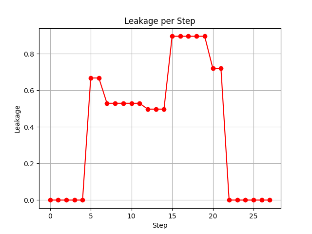

リーケージのシミュレーション
============================

## リーケージとは

Exchange-Only方式においては、3個の量子ドットを1個の量子ビットとして符号化します。全体の量子状態の自由度は2の3乗で8次元ですが、そのうち、全スピン角運動量が$S=1/2$となる特定の2次元の空間のみを計算空間として利用します。が、演算の過程で何らかの理由により、この計算空間からはみ出てしまうことがあります。このはみ出し量のことを「リーケージ(leakage)」と呼びます。量子状態を$\ket{\psi}$、計算空間への射影演算子を$P$とすると、リーケージ$L$は、

```math
L = 1 - |\bra{\psi} P \ket{\psi}|
```
のように表すことができます。

`eoqrid`では、一連の交換相互作用を施した後の量子状態のリーケージを取得することができます。`QuantumState`クラスの`leakage`メソッドを使います。以下、サンプルコードを提示しながら、その使い方を説明します。

## 1量子ビット演算におけるリーケージ

まず、1量子ビットの演算を考えます。1量子ビットを構成する3つの量子ドットに対する交換相互作用は全スピン角運動量と交換するので、全スピン角運動量は保存します。したがって、1量子ビットの状態に対して、どんな交換相互作用を施したとしてもリーケージは発生しません。

以下のサンプルコードを見てください。

```python
import random
import numpy as np
from qiskit import QuantumCircuit

from eoqrid import EoqSimulator, ExchangeInteraction

# single qubit circuit
qc_native = QuantumCircuit(3)

# 3 random exchange interactions
qc_native.append(ExchangeInteraction(random.uniform(0.0, 2.0 * np.pi), 1.0), random.sample(range(3), 2))
qc_native.append(ExchangeInteraction(random.uniform(0.0, 2.0 * np.pi), 1.0), random.sample(range(3), 2))
qc_native.append(ExchangeInteraction(random.uniform(0.0, 2.0 * np.pi), 1.0), random.sample(range(3), 2))

# draw circuit
print(qc_native)

# evaluate leakage
eoq = EoqSimulator()
leak = eoq.execute(qc_native).qstate.leakage()
print(f"leakage = {leak:.6f}")
```
ここで、3つの量子ドットからなる回路`qc_native`を定義して、ランダムに3回交換相互作用を追加しています。この回路を実行した後の量子状態に対してリーケージを取得して、表示するようなプログラムになっています。実行すると、

```
                      ┌───────────────┐┌───────────────┐
q_0: ─────────────────┤1              ├┤0              ├
     ┌───────────────┐│               ││  Ex(5.6692,1) │
q_1: ┤0              ├┤  Ex(1.4685,1) ├┤1              ├
     │  Ex(6.2228,1) ││               │└───────────────┘
q_2: ┤1              ├┤0              ├─────────────────
     └───────────────┘└───────────────┘
leakage = 0.000000

```
のように表示されます。ランダムに回路を作成しているので、実行のたびに量子回路は変わると思います。が、何度やっても`leakage`はゼロです。つまり、1量子ビットでの(交換相互作用による)演算は、計算空間の中で行われるということが確認できました。

ただし、このように交換相互作用のみを正確に実行できるのであればリーケージは発生しませんが、現実デバイスでは交換相互作用以外のノイズ的な作用の影響があるため、1量子ビット演算といえどもリーケージは発生するのだと思います。

## 2量子ビット演算におけるリーケージ

では、2量子ビットではどうなるでしょうか。

### 各量子ビット内部での交換相互作用

2量子ビットの各々の量子ビット内部で交換相互作用を施す前提だとすると、1量子ビットのときと同様リーケージは発生しません。以下のコードで確認してみます。

```python
import random
import numpy as np
from qiskit import QuantumCircuit

from eoqrid import EoqSimulator, ExchangeInteraction

# 2-qubit circuit
qc_native = QuantumCircuit(6)

# 3 random exchange interactions for qubit #0
qc_native.append(ExchangeInteraction(random.uniform(0.0, 2.0 * np.pi), 1.0), random.sample(range(3), 2))
qc_native.append(ExchangeInteraction(random.uniform(0.0, 2.0 * np.pi), 1.0), random.sample(range(3), 2))
qc_native.append(ExchangeInteraction(random.uniform(0.0, 2.0 * np.pi), 1.0), random.sample(range(3), 2))

# 3 random exchange interactions for qubit #1
qc_native.append(ExchangeInteraction(random.uniform(0.0, 2.0 * np.pi), 1.0), random.sample(range(3, 6), 2))
qc_native.append(ExchangeInteraction(random.uniform(0.0, 2.0 * np.pi), 1.0), random.sample(range(3, 6), 2))
qc_native.append(ExchangeInteraction(random.uniform(0.0, 2.0 * np.pi), 1.0), random.sample(range(3, 6), 2))

## exchange interaction for qubit #0 and #1 -> leakage
#qc_native.append(ExchangeInteraction(np.pi / 4.0), [2, 3])

# draw circuit
print(qc_native)

# evaluate leakage
eoq = EoqSimulator()
leak = eoq.execute(qc_native).qstate.leakage()
print(f"leakage = {leak:.6f}")
```
ちょっと長くなりましたが、先ほどの1量子ビットのコードを2量子ビットに単純に拡張しただけです。実行すると、

```
     ┌───────────────┐                 ┌─────────────────┐
q_0: ┤0              ├─────────────────┤1                ├
     │  Ex(2.8097,1) │┌───────────────┐│  Ex(0.026241,1) │
q_1: ┤1              ├┤1              ├┤0                ├
     └───────────────┘│  Ex(1.1287,1) │└─────────────────┘
q_2: ─────────────────┤0              ├───────────────────
      ┌──────────────┐└┬──────────────┤
q_3: ─┤1             ├─┤1             ├───────────────────
      │  Ex(2.601,1) │ │  Ex(6.044,1) │ ┌───────────────┐
q_4: ─┤0             ├─┤0             ├─┤1              ├─
      └──────────────┘ └──────────────┘ │  Ex(5.8558,1) │
q_5: ───────────────────────────────────┤0              ├─
                                        └───────────────┘
leakage = 0.000000
```
のように表示されます。ランダムに回路を作成しているので実行の度に量子回路は変わりますが、`leakage`の値は常にゼロです。この場合も、演算は必ず計算空間の中で行われるということが確認できました。

### 2つの量子ビットにまたがる交換相互作用

ところが、2つの量子ビットにまたがる交換相互作用が入ってくると状況は変わります。このような交換相互作用は全スピン角運動量と交換しないため保存量となりません。つまり、計算空間からはみ出てしまうリーケージが発生します。

それを確認するため、上のコードのコメント行を以下のように外してみます。

```python
# exchange interaction for qubit #0 and #1 -> leakage
qc_native.append(ExchangeInteraction(np.pi / 4.0), [2, 3])
```
これは、2番目と3番目の量子ドット間の交換相互作用なので、2つの量子ビットにまたがる交換相互作用になります。実行すると、

```
     ┌───────────────┐
q_0: ┤0              ├─────────────────────────────────────────────────
     │               │┌───────────────┐ ┌───────────────┐
q_1: ┤  Ex(1.2482,1) ├┤0              ├─┤0              ├──────────────
     │               ││  Ex(5.7115,1) │ │  Ex(2.2705,1) │┌────────────┐
q_2: ┤1              ├┤1              ├─┤1              ├┤0           ├
     ├───────────────┤├───────────────┴┐├───────────────┤│  Ex(π/4,1) │
q_3: ┤1              ├┤0               ├┤1              ├┤1           ├
     │               ││  Ex(0.52123,1) ││               │└────────────┘
q_4: ┤  Ex(1.6869,1) ├┤1               ├┤  Ex(2.5678,1) ├──────────────
     │               │└────────────────┘│               │
q_5: ┤0              ├──────────────────┤0              ├──────────────
     └───────────────┘                  └───────────────┘
leakage = 0.043582
```
となり、リーケージが発生することがわかりました。

## CNOTゲートにおけるリーケージの推移

2量子ビット演算の代表選手にCNOTゲートがあります。これを交換相互作用の系列で表現しようとすると、どうしても2つの量子ビットにまたがる交換相互作用を使用せざるを得ません。これまでいろんなCNOT構成法が提案されていますが、リーケージが発生しないようにうまく設計されています。交換相互作用系列の途中段階ではリーケージが発生したとしても、最終的に計算空間に着地してリーケージが起きない系列になっているのです。例えば、Fong-WandzuraのCNOTゲートを題材にして、その様子を見てみましょう。以下のコードを見てください。

```python
import numpy as np
import matplotlib.pyplot as plt
from qiskit import QuantumCircuit

from eoqrid import EoqSimulator, ExchangeInteraction

a , b = 0, 1
(a6, a5, a4) = (a * 3, a * 3 + 1, a * 3 + 2)
(a1, a2, a3) = (b * 3, b * 3 + 1, b * 3 + 2)
phase_1 = np.arccos(1.0 / np.sqrt(3.0))
phase_2 = np.arccos(2.0 * np.sqrt(2.0) / 3.0)
phase_3 = np.arccos(-2.0 * np.sqrt(2.0) / 3.0)
phase_4 = np.arccos(1.0 / np.sqrt(3.0))

# args of ExchangeInteraction for Fong-Wandzura CNOT
args_list = []
args_list.append((ExchangeInteraction(2.0 * np.pi - phase_1, 1.0), [a2, a1]))
args_list.append((ExchangeInteraction(np.pi, 1.0), [a5, a4]))
args_list.append((ExchangeInteraction(phase_2, 1.0), [a3, a2]))
args_list.append((ExchangeInteraction(np.pi, 1.0), [a6, a5]))
args_list.append((ExchangeInteraction(np.pi, 1.0), [a2, a1]))
args_list.append((ExchangeInteraction(np.pi, 1.0), [a4, a3]))
args_list.append((ExchangeInteraction(3.0 * np.pi / 2.0, 1.0), [a3, a2]))
args_list.append((ExchangeInteraction(3.0 * np.pi / 2.0, 1.0), [a4, a3]))
args_list.append((ExchangeInteraction(np.pi / 2.0, 1.0), [a2, a1]))
args_list.append((ExchangeInteraction(np.pi / 2.0, 1.0), [a3, a2]))
args_list.append((ExchangeInteraction(np.pi, 1.0), [a5, a4]))
args_list.append((ExchangeInteraction(np.pi, 1.0), [a2, a1]))
args_list.append((ExchangeInteraction(np.pi / 2.0, 1.0), [a4, a3]))
args_list.append((ExchangeInteraction(3.0 * np.pi / 2.0, 1.0), [a3, a2]))
args_list.append((ExchangeInteraction(np.pi / 2.0, 1.0), [a5, a4]))
args_list.append((ExchangeInteraction(np.pi / 2.0, 1.0), [a4, a3]))
args_list.append((ExchangeInteraction(np.pi, 1.0), [a2, a1]))
args_list.append((ExchangeInteraction(np.pi, 1.0), [a5, a4]))
args_list.append((ExchangeInteraction(np.pi / 2.0, 1.0), [a3, a2]))
args_list.append((ExchangeInteraction(np.pi / 2.0, 1.0), [a2, a1]))
args_list.append((ExchangeInteraction(3.0 * np.pi / 2.0, 1.0), [a4, a3]))
args_list.append((ExchangeInteraction(3.0 * np.pi / 2.0, 1.0), [a3, a2]))
args_list.append((ExchangeInteraction(np.pi, 1.0), [a4, a3]))
args_list.append((ExchangeInteraction(np.pi, 1.0), [a2, a1]))
args_list.append((ExchangeInteraction(np.pi, 1.0), [a6, a5]))
args_list.append((ExchangeInteraction(phase_3, 1.0), [a3, a2]))
args_list.append((ExchangeInteraction(np.pi, 1.0), [a5, a4]))
args_list.append((ExchangeInteraction(phase_4, 1.0), [a2, a1]))

# get leakage sequence
eoq = EoqSimulator()
qc_native = QuantumCircuit(6)
y = []
for args in args_list:
    qc_native.append(*args)
    leakage = eoq.execute(qc_native).qstate.leakage()
    y.append(leakage)
x = list(range(len(y)))

# plot leakage sequence
plt.plot(x, y, marker='o', color='red')
plt.title("Leakage per Step")
plt.xlabel("Step")
plt.ylabel("Leakage")
plt.grid(True)
plt.show()
```
ここで、`args_list`は、`ExchangeInteraction`ゲートを量子回路に`append`するための引数系列が格納されています。この系列でCNOTを実現するのがFong-WandzuraのCNOTです。`args_list`が得られたら、これに基づき量子回路に`ExchangeInteraction`ゲートを順に追加していきます。一つ追加する度にこの回路を実行して量子状態を得て、`leakage`メソッドによりリーケージの値を得ます。この値をリスト`y`に格納して`matplotlib`で折れ線グラフにしています。

実行すると、以下のグラフが表示されます。



CNOTを構成する交換相互作用の系列の途中段階では、リーケージが発生しているのですが、最終的にリーケージがゼロになるように構成されていることがわかります。

このように、理想的なパルス系列によってCNOTゲートを正確に実行できるのであればリーケージは発生しません。が、現実的にはパルスの波形が乱れる等の理由により、リーケージは発生します。例えば、上の回路の中のどれかの`ExchangeInteraction`のパラメータ値を適当に変更してみてください。CNOT演算完了後にリーケージが残ってしまうことわかると思います（お試しあれ）。

## 参考文献

- [Aaron J. Weinstein, et al., "Universal logic with encoded spin qubits in silicon",arXiv:2202.03605](https://arxiv.org/abs/2202.03605)
- [計算基底からのボトムアップ検証：Fong-Wandzura CZゲートにおけるリーケージ抑制の軌跡](https://zenn.dev/yuichirominato/articles/8460d94902da55)

以上
