論理量子回路のトランスパイル
============================

## 簡単な例

`eoqrid`では、`qiskit`の量子回路(`QuantumCircuit`)を使って量子回路を定義します。例えば、アダマールゲート1個からなる、量子回路を定義する場合、

```python
from qiskit import QuantumCircuit
qc = QuantumCircuit(1)
qc.h(0)
```
のようにします。

```python
print(qc)
```
とすると、以下のように量子回路が作成されることがわかります。

```
   ┌───┐
q: ┤ H ├
   └───┘
```
まず、この回路を`eoqrid`を使ってトランスパイルしてみましょう。

```python
from eoqrid import EoqEngine
eoq = EoqEngine(3)
```
のように、`EoqEngine`クラスのインスタンスを作成します。ここで、`EoqEngine`の引数に指定されている`3`は、必要な物理的な量子ドット数(つまり、電子スピン数)を表します。いま、論理的な量子ビット数が1の量子回路を実行しようとしています。Exchange-Only方式では、1つの論理量子ビット当たり3つの量子ドットで符号化されますので、実行しようとしている論理量子ビット数の3倍の値をここで指定します。

このように`EoqEngine`のインスタンスを作成した後、

```python
qc_phys = eoq.transpile(qc)
print(qc_phys)
```
のように、`transpile`メソッドを使います。結果は、以下のように3量子ビットの回路になります。

```
         ┌──────┐┌───────────────┐                 ┌───────────────┐
q_0 -> 0 ┤0     ├┤0              ├─────────────────┤0              ├
         │  Sin ││  Ex(5.3279,1) │┌───────────────┐│  Ex(5.3279,1) │
q_1 -> 1 ┤1     ├┤1              ├┤0              ├┤1              ├
         └──────┘└───────────────┘│  Ex(1.9106,1) │└───────────────┘
q_2 -> 2 ──|0>────────────────────┤1              ├─────────────────
                                  └───────────────┘
```
この量子回路で、`Ex`と記載されているボックスは、交換相互作用(Exchange Interaction)を表しています。各々のボックス中の括弧内の数字の一つ目は、交換相互作用の継続時間です。二つ目はすべて1になっていますが、これは交換相互作用の強さのようなものだと思ってください(とりあえず、デフォルトで"1"になっています)。また、一番最初に`Sin`というゲートとリセットを表す`|0>`が入っています。これは、3つの物理量子ビットを使って、論理的な`|0>`状態、すなわち、シングレット状態

```
logical |0> = (|01> - |10>)|0> / sqrt(2)
```
を作成する手続きです。

次に、2量子ビット回路の例を示します。

```python
from qiskit import QuantumCircuit
qc = QuantumCircuit(2)
qc.h(0)
qc.cx(0, 1)
```
この量子回路をトランスパイルしてみます。2量子ビットの回路なので、`EoqEngine`への引数はその3倍の`6`とします。結果の回路を今度はmatplotlibで表示してみます。`plot_qc`関数を使うのが便利です。

```python
from eoqrid import EoqEngine
from eoqrid.util import plot_qc
eoq = EoqEngine(6)

qc_phys = eoq.transpile(qc)
plot_qc(qc_phys)
```
以下のように、量子回路が表示されます。

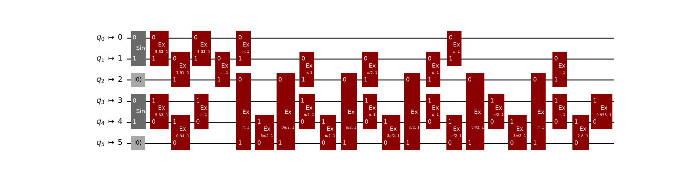

## デバイスのトポロジーに応じたトランスパイル

この量子回路をよく見てみてください。交換相互作用がいろんな量子ビット(物理的には量子ドット)同士の間に作用しています。しかし、現実デバイス(量子チップ)の量子ドットは任意に全結合されているとは限りません。というか、全結合はおそらく無理なので、近接量子ドット同士のみが接続されているはずです。なので、例えば、2番目と5番目の量子ドット同士が接続されていないデバイスでは、上の回路は実行不可能です。そのため、実際の量子ドット同士の接続関係(トポロジー)を考慮してトランスパイルする必要があります。具体的には、適宜スワップゲートを挿入してルーティングする必要があります。

`eoqrid`では、このトポロジーを`DotArchitecture`クラスのオブジェクトとして表現して、`EoqEngine`クラスのコンストラクタ引数として設定することで、ルーティング処理を行った後の物理量子回路を出力することができます。では、やってみます。まず、トポロジーを定義します。

```python
from eoqrid import DotArchitecture
arch = DotArchitecture()
arch.add_edge(0, 1)
arch.add_edge(1, 2)
arch.add_edge(2, 3)
arch.add_edge(3, 4)
arch.add_edge(4, 5)
```
これで、6個の量子ドットが直線的に接続しているトポロジーが表現できました。表現できたらその接続関係を確認したいです。`eoqrid`には、これを可視化する関数`plot_arch`があります。以下のように実行すると、

```python
from eoqrid.util import plot_arch
plot_graph(arch)
```

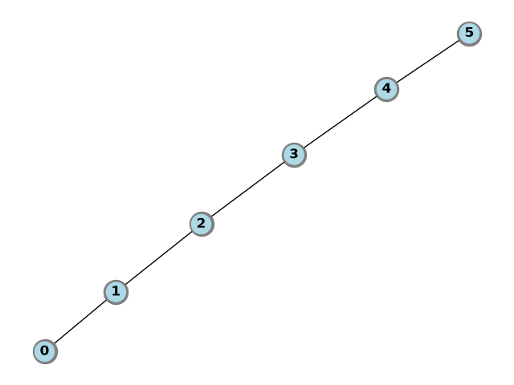

のように可視化されます。

これを、`EoqEngine`クラスのコンストラクタ引数に与えます。その上で、先ほどと同様にトランスパイルします。

```python
from eoqrid import EoqEngine
from eoqrid.util import plot_qc

eoq = EoqEngine(arch)
qc_phys = eoq.transpile(qc)
plot_qc(qc_phys)
```
実行すると、

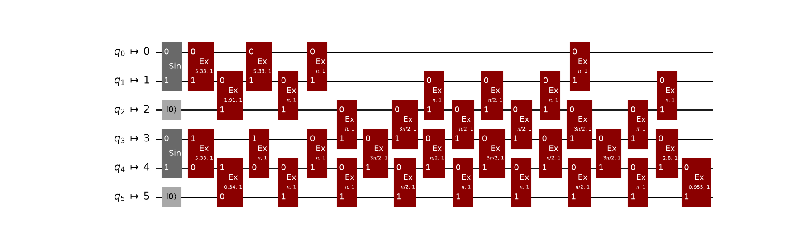

という結果が得られます。回路の深さは、

```python
print(f"depth = {qc_phys.depth()}")
```
で得られて、
```
depth = 19
```
となりました(トポロジーに応じたルーティングは確率的なアルゴリズムになっているため、いつもこの値になるとは限りません。以下同様)。

では、異なるトポロジーで実行するとどうなるでしょうか。ということで、やってみます。

```python
from eoqrid import DotArchitecture
arch = DotArchitecture()
arch.add_edge(0, 1)
arch.add_edge(1, 2)
arch.add_edge(1, 4)
arch.add_edge(3, 4)
arch.add_edge(4, 5)
plot_arch(arch)
```
0,1,2番目が直線接続され、3,4,5番目も直線接続され、各々真ん中の1番目と4番目が接続されているグラフが作成できました。

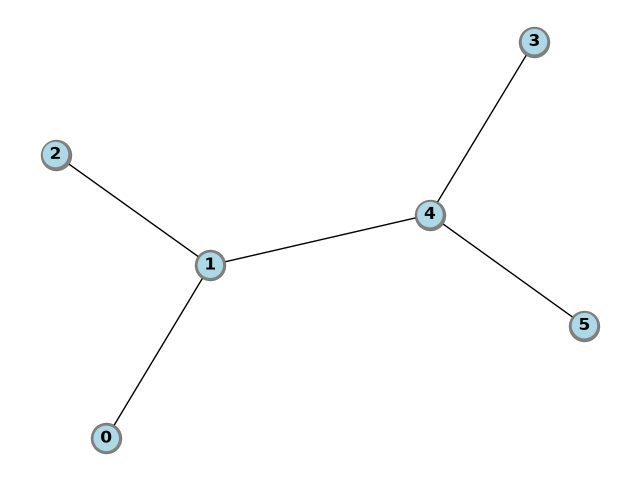

では、実行してみます。

```python
eoq = EoqEngine(arch)
qc_phys = eoq.transpile(qc)
plot_qc(qc_phys)
print(f"depth = {qc_phys.depth()}")
```
そうすると、以下の量子回路が得られます。

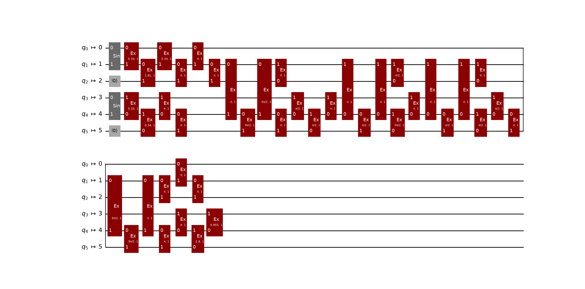

回路深さは、
```
depth = 32
```
で、先ほどと比べてぐっと大きくなりました。デバイスのトポロジーが、トランスパイルしたい量子回路に適しているかどうか次第で、回路深さは大きくなったり小さくなったりします。

## トランスパイルの最適化

与えられたデバイスのトポロジーにおいて、ルーティングや量子ドットへのレイアウトを工夫することで、なるべく回路深さが小さくなるように最適化したいです。`eoprid`には、その最適化レベルを指定するオプションも用意されています。トランスパイル時に、

```python
qc_phys = eoq.transpile(qc, optimization_level=1)
```
のように`optimization_level`を指定します。最適化のレベルは0,1,2,3で指定します。デフォルト値は0で、これは何も最適化しないことを意味します。数値が大きくなるに従い、高度な最適化を実行するようになります(内部的には`qiskit`の汎用的なレイアウトおよびルーティング最適化機能を使っています)。

それでは、最適化の効果が実際にどの程度になるか見てみます。先ほどまでの簡単な回路ではあまり面白くないので、もっと規模の大きい回路でやってみます。量子回路は、関数random_quantum_circuitを使ってランダムに作成します。また、デバイスのトポロジーは、関数random_archを使ってランダムに作成します。そして、optimization_levelを0,1,2,3に変えてトランスパイルして、結果の量子回路の深さを順に表示します。コードは以下の通りです。

```python
from eoqrid import EoqEngine
from eoqrid.util import plot_qc, plot_arch, random_quantum_circuit, random_arch

num_qubits = 3
num_dots = num_qubits * 3
depth = 100
seed = 12345

qc = random_quantum_circuit(num_qubits, depth, seed=seed)
plot_qc(qc)

arch = random_arch(num_dots, num_dots, seed=seed)
plot_arch(arch)

print("== optimization_level, depth ==")
eoq = EoqEngine(arch)
for optimization_level in (0, 1, 2, 3):
    qc_phys = eoq.transpile(qc, optimization_level=optimization_level, seed=seed)
    print(f"optimization_level = {optimization_level}, depth = {qc_phys.depth()}")
```

このコードで作成されたトポロジーと量子回路は、以下のようになります。

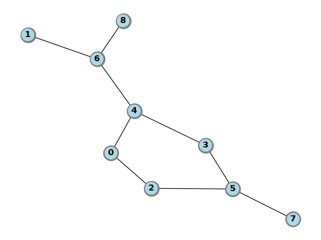

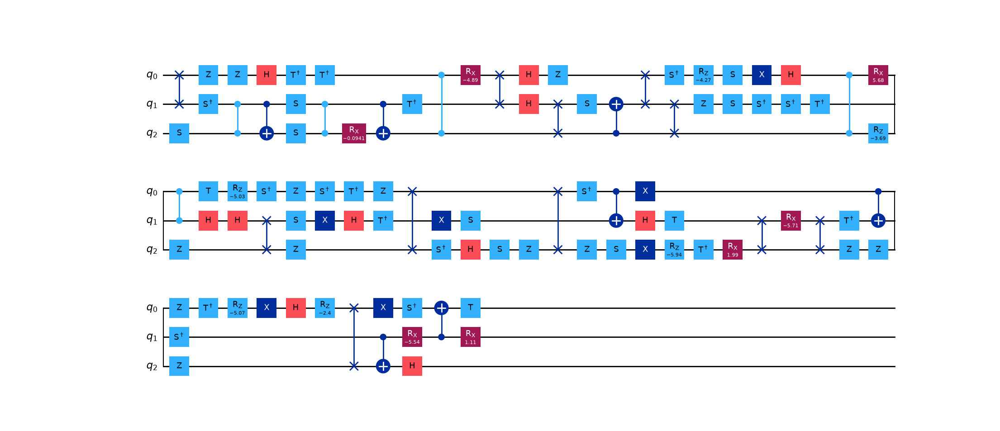

実行結果は以下の通りとなり、最適化レベルを上げるに従い、回路深さが小さくなっていくことがわかります。

```
== optimization_level, depth ==
optimization_level = 0, depth = 510
optimization_level = 1, depth = 451
optimization_level = 2, depth = 424
optimization_level = 3, depth = 424
```

以上、ここまで述べてきた量子回路は測定を含まないものに関する例でしたが、測定を含む回路でも同様のことは実行可能です。


## 測定を含む論理量子回路のトランスパイル

例えば、Xゲートの後に測定を追加してみます。

```python
qc = QuantumCircuit(1, 1)
qc.x(0)
qc.measure(0, 0)
print(qc)
```

以下のような論理量子回路です。

```
     ┌───┐┌─┐
  q: ┤ X ├┤M├
     └───┘└╥┘
c: 1/══════╩═
           0
```
これをトランスパイルします。`EoqEngine`には、`DotArchitecture`ではなく、単なる整数値`3`を指定します。先ほどは、説明を省略してしまったのですが、このように整数値を指定すると、内部的には全結合のトポロジーが設定されます。そして、すべての量子ドットにおいて測定操作が実行できる量子チップが設定されます。シリコンスピン量子コンピュータにおいて、全結合であり、かつ、すべての量子ドットに対して測定できる量子チップを実現するのはとても難しいと思われるので、一つの理想形として、こういう設定も可能であるという風にご理解ください。これが実際にどんなトポロジーになるかは、

```python
from eoqrid import EoqEngine
from eoqrid.util import plot_arch

eoq = EoqEngine(3)
plot_arch(eoq.arch)
```
で確認することができます。

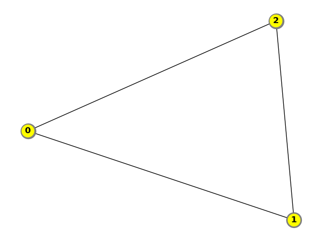

となり、すべてのノード同士が接続しているトポロジーになっていることがわかります。そして、ノードの色が「黄色」になっていることに注目してください。この色には意味があります。Exchange-Only方式における測定は、1つの論理量子ビットを構成する3つの量子ドットのうち最初の2つに関する操作になります。具体的には、最初の2つがシングレットになっているかトリプレットになっているかで論理的な0/1を判定します。測定可能な最初の2つの量子ドットを各々「0番目の測定量子ドット」「1番目の測定量子ドット」と呼ぶことにすると(以下同様)、この「黄色」は、「0番目の測定量子ドット」にもなれるし「1番目の測定量子ドット」にもなれるということを意味しています。

では、この設定でトランスパイルしてみましょう。

```python
qc_phys = eoq.transpile(qc)
print(qc_phys)
```

結果は、以下のようになります。

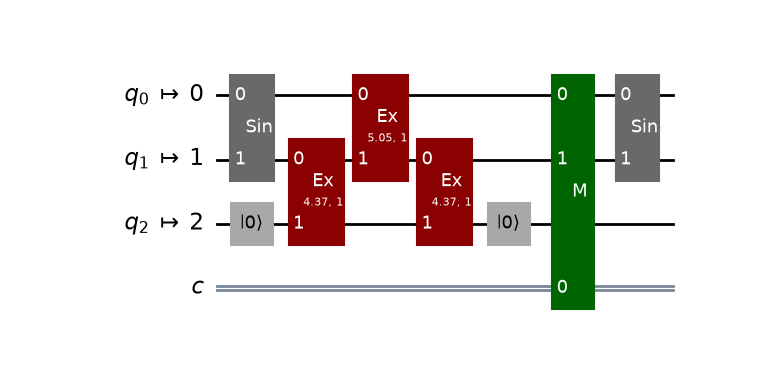

ここで、Mでラベリングされているボックスが測定を表しています。どの量子ドットも0番目および1番目の量子ドットになれるということで、この例の場合、0番目と1番目の量子ドットが測定量子ドットになったことがわかります。`eoqrid`では、測定した後の3つの量子ドットを再び使用できるようにするため、シングレット状態に初期化する操作を自動挿入するようになっています。ということで、最後の0番目と1番目の量子ドットをシングレットに初期化する`Sin`が入っています。また、2番目の量子ドットには(測定と前後していますが)`|0>`にリセットする操作が入っています。

次に、全結合ではないトポロジーで、かつ、特定の量子ドットにしか測定操作が許されない量子チップの場合、どうするかを見ていきます。例えば、以下のように、0番目、1番目、2番目の量子ドットが直線状につながっているトポロジーを考えてみます。

```python
from eoqrid import DotArchitecture
from eoqrid.util import plot_arch

arch = DotArchitecture()
arch.add_edge(0, 1)
arch.add_edge(1, 2)
plot_arch(eoq.arch)
```

`plot_arch`で表示すると、

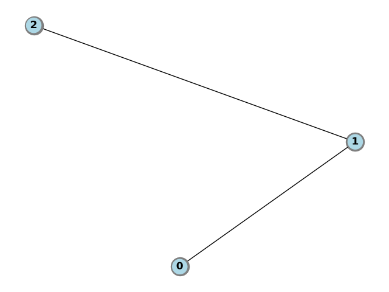

のようになります。ノードの色は「薄い青色」(面倒なので以降青色と言います)です。この場合、すべての量子ドットには測定操作が許されていません。

測定を許可する量子ドットを設定するために、`add_readout_pair`メソッドを使います。1番目と2番目の量子ドットを各々「0番目の測定量子ドット」「1番目の測定量子ドット」に設定する場合、

```python
arch.add_readout_pair(1, 2)
```

のようにします。`plot_arch`で表示すると、

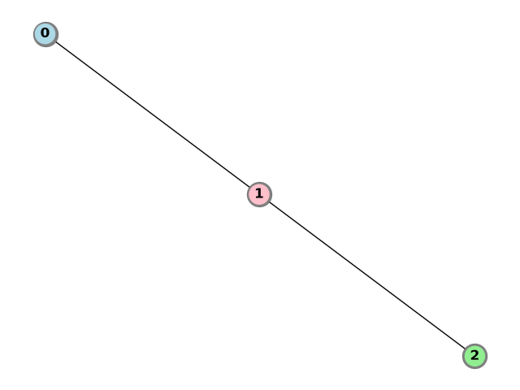

のようになります。1番目の量子ドットが「薄い赤色」(面倒なので以降赤色と言います)、2番目の量子ドットが「薄い緑色」(面倒なので以降緑色と言います)のように変わりました。つまり、「0番目の測定量子ドット」は「赤色」、「1番目の測定量子ドット」は「緑色」と表示されます。

さらに、逆に、2番目と1番目の量子ドットを各々「0番目の測定量子ドット」「1番目の測定量子ドット」に設定する場合は、

```python
arch.add_readout_pair(2, 1)
```

のようにします。こうすると、結局、1番目と2番目の量子ドットは、どっち向きの測定も許されるということになります。`plot_arch`で表示すると、

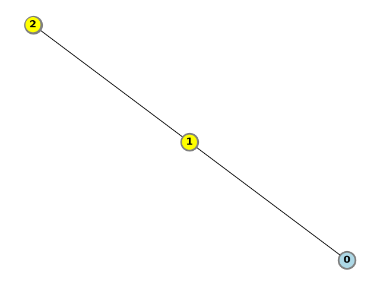

のようになります。1番目と2番目の量子ドットがともに「黄色」に変わりました。「黄色」は、どっちの測定量子ドットにもなれるということを意味します。

では、この量子ドットのアーキテクチャのもとで、先ほどの論理量子回路をトランスパイルしてみます。

```python
eoq = EoqEngine(arch)
qc_phys = eoq.transpile(qc)
plot_qc(qc_phys)
```

結果は、以下のようになります。

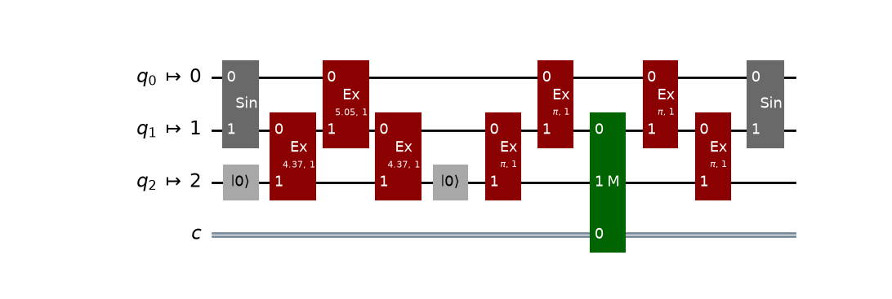

1番目と2番目の量子ドットしか測定が許されないので、測定量子ドットに向かって適当にスワップが挿入されて(つまり、ルーティングされて)、1番目と2番目の量子ドットに到達したら測定されて、その後、元に戻るようにルーティングされていることがわかります。

以上
