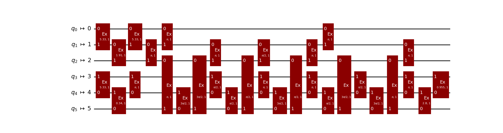
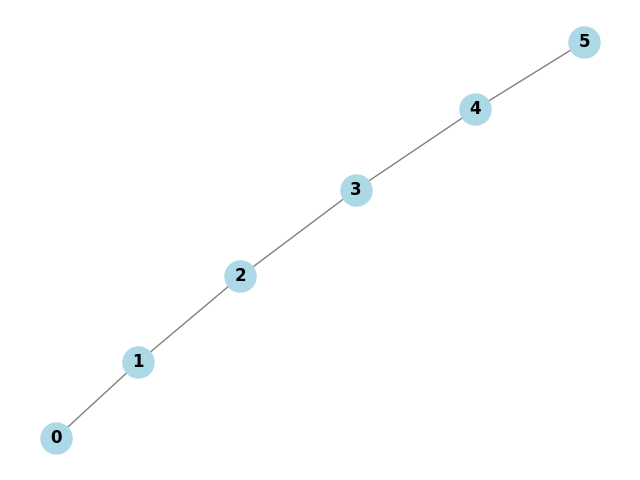
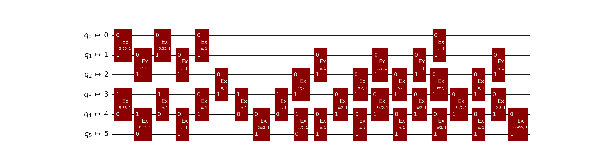
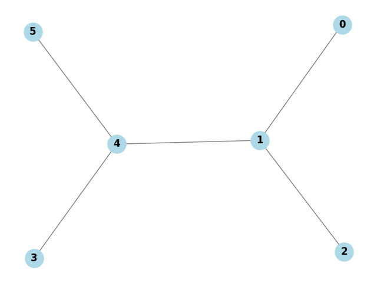
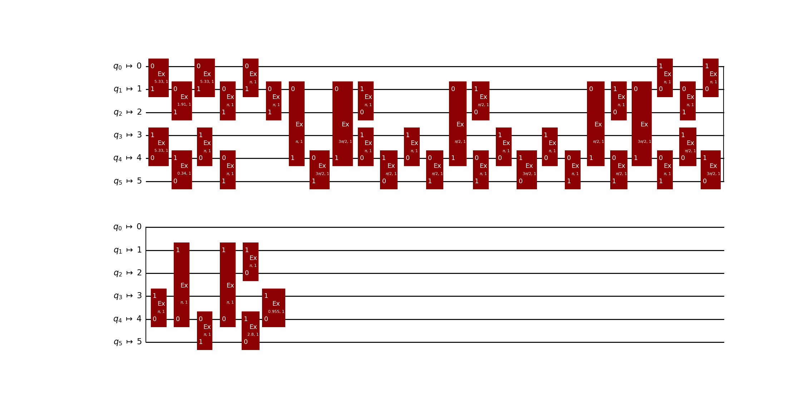
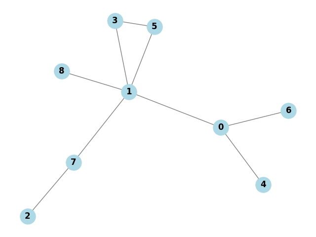
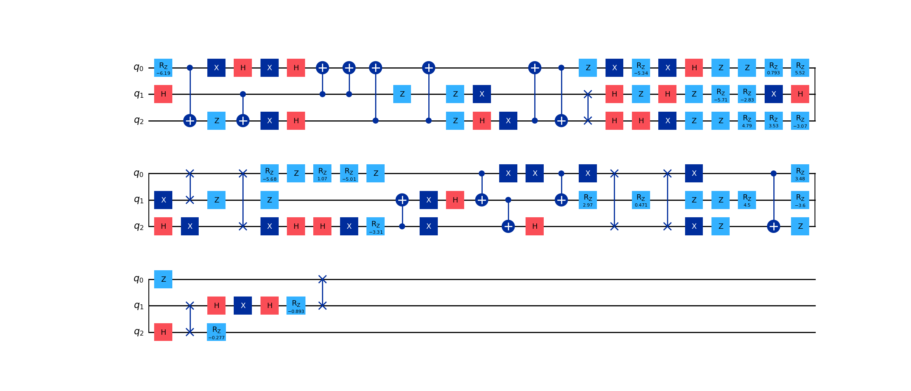

Tutorial(japanese)
==================

`eoqrid`は、Exchange-Only方式で量子ビットを制御するシリコン量子コンピュータをシミュレートするためのPythonライブラリです。以下に示す2つの機能を提供しています。

* **論理量子回路のトランスパイル**
  - 論理的に記述された量子回路をシリコン量子ビット上で実行できるように交換相互作用および測定の集合に変換することができます。さらに量子チップのトポロジーに応じた形に変換・最適化することができます。

* **物理量子回路の実行**
  - 交換相互作用および測定の集合で記述された物理的な量子回路を実行した結果をシミュレーションにより確認することができます。
  
以下では、上記2つの機能をどのように実行するかを順に説明します。

## 論理量子回路のトランスパイル

### 簡単な例(1量子ビット回路)

`eoqrid`では、`qiskit`の量子回路(`QuantumCircuit`)を使って量子回路を定義します。例えば、アダマールゲート1個からなる、量子回路を定義する場合、

```python
from qiskit import QuantumCircuit
qc = QuantumCircuit(1)
qc.h(0)
```
のようにします。

```python
print(qc)
```
とすると、以下のように量子回路が作成されたことがわかります。

```
   ┌───┐
q: ┤ H ├
   └───┘
```
この回路を`eoqrid`を使ってトランスパイルするには、

```python
from eoqrid import EoqSimulator
eoq = EopSimulator()
```
のように、`EoqSimulator`クラスのインスタンスを作成した後、

```python
qc_native = eoq.transpile(qc)
print(qc_native)
```
のように、`transpile`メソッドを使います。結果は、以下のようになります。

```
         ┌───────────────┐                 ┌───────────────┐
q_0 -> 0 ┤0              ├─────────────────┤0              ├
         │  Ex(5.3279,1) │┌───────────────┐│  Ex(5.3279,1) │
q_1 -> 1 ┤1              ├┤0              ├┤1              ├
         └───────────────┘│  Ex(1.9106,1) │└───────────────┘
q_2 -> 2 ─────────────────┤1              ├─────────────────
                          └───────────────┘
```
論理量子回路が1量子ビットだったので、トランスパイル後の量子回路(物理量子回路)は3量子ビットの回路になります。論理2量子ビット回路の場合、トランスパイル後は、6量子ビット回路になります。Exchange-Onlyでは、3つの物理的な量子ビット(量子ドット)を1つの論理量子ビットにマッピングするので、トランスパイルによって量子ビット数が3倍になります。

トランスパイル後の物理量子回路で、`Ex`と記載されているボックスは、交換相互作用(Exchange Interaction)を表しています。各々のボックス中の括弧内の数字の一つ目は、交換相互作用の継続時間です。ゲート電圧のパルスをどの程度の時間印加させるかを表しています。二つ目はすべて1になっていますが、これは印加させる電圧の強さのようなものだと思ってください（とりあえず、デフォルトで"1"になっています）。

測定を含む回路もトランスパイルできます。アダマールゲートの後に測定を追加してみます。

```python
qc = QuantumCircuit(1, 1)
qc.h(0)
qc.measure(0, 0)
eoq = EopSimulator()
qc_native = eoq.transpile(qc)
print(qc_native)
```
結果は、以下のようになります。

```
         ┌───────────────┐                 ┌───────────────┐┌────┐
q_0 -> 0 ┤0              ├─────────────────┤0              ├┤0   ├
         │  Ex(5.3279,1) │┌───────────────┐│  Ex(5.3279,1) ││    │
q_1 -> 1 ┤1              ├┤0              ├┤1              ├┤1   ├
         └───────────────┘│  Ex(1.9106,1) │└───────────────┘│  M │
q_2 -> 2 ─────────────────┤1              ├─────────────────┤    ├
                          └───────────────┘                 │    │
      c: ═══════════════════════════════════════════════════╡0   ╞
                                                            └────┘
```
ここで、Mでラベリングされているボックスが測定を表しています。Exchange-Onlyでは、1論理量子ビットの測定は、3つの物理量子ビットのはじめの2つに対して操作を行い、一つの測定値(バイナリ値)を古典ビットに書き込む処理になります。

### 簡単な例(2量子ビット回路)

次に、2量子ビット回路の例を示します。

```python
from qiskit import QuantumCircuit
qc = QuantumCircuit(2)
qc.h(0)
qc.cx(0, 1)
```
この量子回路をトランスパイルしてみます。結果の回路を今度はmatplotlibで表示してみます。`plot_qc`関数を使うのが便利です。

```python
from eoqrid import EoqSimulator
from eoqrid.util import plot_qc
eoq = EopSimulator()

qc_native = eoq.transpile(qc)
plot_qc(qc_native)
```


### デバイスのトポロジーに応じたトランスパイル

この量子回路をよく見てみてください。交換相互作用がいろんな量子ビット(物理的には量子ドット)同士の間に作用しています。しかし、現実デバイス(量子チップ)の量子ドットは任意に全結合されているとは限りません。というか、全結合はおそらく無理なので、近接量子ドット同士のみが接続されているはずです。なので、例えば、2番目と5番目の量子ドット同士が接続されていないデバイスでは、上の回路は実行不可能です。そのため、実際の量子ドット同士の接続関係(トポロジー)を考慮してトランスパイルする必要があります。具体的には、適宜スワップゲートを挿入してルーティングする必要があります。

`eoqrid`では、networkxのグラフによって表現されたトポロジーのデータを`EoqSimulator`クラスの属性値として設定することで、ルーティング処理を行った後の物理量子回路を出力することができます。では、やってみます。

```python
import networkx as nx
topo = nx.Graph()
topo.add_edge(0, 1)
topo.add_edge(1, 2)
topo.add_edge(2, 3)
topo.add_edge(3, 4)
topo.add_edge(4, 5)
```
これで、6個の量子ドットが直線的に接続しているトポロジーを表現できます。表現できたらその接続関係を確認したいです。`eoqrid`には、これを可視化する関数`plot_graph`があります。以下のように実行すると、

```python
from eoqrid.util import plot_graph
plot_graph(topo)
```



のように可視化されます。

これを、`EoqSimulator`クラスのコンストラクタ引数に与えます。その上で、先ほどと同様にトランスパイルします。

```python
eoq = EoqSimulator(topo)
qc_native = eoq.transpile(qc)
plot_qc(qc_native)
```
実行すると、



という結果が得られます。回路の深さは、

```python
print(f"depth = {qc_native.depth()}")
```
で得られて、
```
depth = 21
```
となりました(トポロジーに応じたルーティングは確率的なアルゴリズムになっているため、いつも18になるとは限りません。以下同様)。

では、異なるトポロジーで実行するとどうなるでしょうか。ということで、やってみます。

```python
import networkx as nx
topo = nx.Graph()
topo.add_edge(0, 1)
topo.add_edge(1, 2)
topo.add_edge(1, 4)
topo.add_edge(3, 4)
topo.add_edge(4, 5)
plot_graph(topo)
```
0,1,2番目が直線接続され、3,4,5番目も直線接続され、各々真ん中の1番目と4番目が接続されているグラフが作成できました。



では、実行してみます。

```python
eoq.topology = topo
qc_native = eoq.transpile(qc)
plot_qc(qc_native)
print(f"depth = {qc_native.depth()}")
```
そうすると、以下の量子回路が得られます。



回路深さは、
```
depth = 31
```
で、先ほどと比べてぐっと大きくなりました。デバイスのトポロジーが、トランスパイルしたい量子回路に適しているかどうか次第で、回路深さは大きくなったり小さくなったりします。

上の回路は測定を含まない回路に対する例でしたが、測定を含む回路でも同様のことは実行可能です。

### トランスパイルの最適化

与えられたデバイスのトポロジーにおいて、ルーティングのやり方や量子ドットのレイアウトの仕方を工夫することで、なるべく回路深さが小さくなるようにしたいです。`eoprid`には、その最適化レベルを指定するオプションも用意されています。トランスパイル時に、

```python
qc_native = eoq.transpile(qc, optimization_level=1)
```
のように`optimization_level`を指定します。最適化のレベルは0,1,2,3で指定します。デフォルト値は0で、これは何も最適化しないことを意味します。数値が大きくなるに従い、高度な最適化を実行するようになります(内部的には`qiskit`の汎用的なレイアウトおよびルーティング最適化機能を使っています)。

それでは、最適化の効果が実際にどの程度になるか見てみます。先ほどまでの簡単な回路ではあまり面白くないので、もっと規模の大きい回路でやってみます。量子回路は、関数random_quantum_circuitを使ってランダムに作成します。また、デバイスのトポロジーは、関数random_connected_graphを使ってランダムに作成します。そして、optimization_levelを0,1,2,3に変えてトランスパイルして、結果の量子回路の深さを順に表示します。コードは以下の通りです。

```python
from eoqrid import EoqSimulator
from eoqrid.util import plot_qc, plot_graph, random_quantum_circuit, random_connected_graph

num_qubits = 3
num_dots = num_qubits * 3
depth = 100
seed = 1234

qc = random_quantum_circuit(num_qubits, depth, seed)
plot_qc(qc)

topo = random_connected_graph(num_dots, num_dots, seed)
plot_graph(topo)

print("== optimization_level, depth ==")
eoq = EoqSimulator(topo)
for optimization_level in (0, 1, 2, 3):
    qc_native = eoq.transpile(qc, optimization_level=optimization_level, seed=seed)
    print(f"optimization_level = {optimization_level}, depth = {qc_native.depth()}")
```

このコードで作成されたトポロジーと量子回路は、以下のようになりました。





実行結果は以下の通りとなり、最適化レベルを上げるに従い、回路深さが小さくなっていくことがわかりました。

```
== optimization_level, depth ==
optimization_level = 0, depth = 821
optimization_level = 1, depth = 685
optimization_level = 2, depth = 670
optimization_level = 3, depth = 670
```
上の回路は測定を含まない回路に関する例でしたが、測定を含む回路でも同様のことは実行可能です。

## 物理量子回路の実行

### トランスパイル後の量子回路を実行

トランスパイルできたら、次にその回路を実際のデバイスで実行したくなります。`EoqSimulator`クラスを使ってそれをシミュレートすることができます。

いま、以下のように、量子回路とデバイスのトポロジーを作成します。

```python
import networkx as nx
from qiskit import QuantumCircuit
from eoqrid import EoqSimulator

qc = QuantumCircuit(2)
qc.h(0)
qc.cx(0, 1)

topo = nx.Graph()
topo.add_edge(0, 1)
topo.add_edge(1, 2)
topo.add_edge(1, 4)
topo.add_edge(3, 4)
topo.add_edge(4, 5)
```
この量子回路をトランスパイルします。`optimization_level`は適当に2としておきます。

```python
eoq = EoqSimulator(topo)
qc_native = eoq.transpile(qc, optimization_level=2)
```
これで、物理量子回路`qc_native`が得られました。実行するには、`EoqSimulator`クラスの`execute`メソッドを使います。返却値は`eoqrid`の`Result`クラスであり、その中の属性値`qstate`(`eoqrid`の`QuantumState`クラス)に結果の量子状態が保持されます。

```python
res = eoq.execute(qc_native)
```
これで変数`res`に結果が格納されました。`res`の属性値`qstate`に対して`draw`メソッドを実行することで、結果の状態ベクトルを表示することができます。

```python
print("== quantum state (logical) ==")
res.qstate.draw()
```
実行すると、

```
== quantum state (logical) ==
c[00] = +0.7071+0.0000*i : 0.5000 |++++++
c[01] = -0.0000-0.0000*i : 0.0000 |
c[10] = +0.0000-0.0000*i : 0.0000 |
c[11] = +0.7071-0.0000*i : 0.5000 |++++++
```
こんな形で表示されます。一番右側の`+`の羅列は状態ベクトルの各複素成分の絶対値の2乗の大きさを表す棒グラフと思ってください。その左の0.5000とか0.000と記載されているのはその値です。これで、入力した量子回路を実行した後の論理量子状態ベクトルが確認できました。

物理的な6量子ビット状態のベクトルも表示することができます。`draw`メソッドのオプション`mode`に文字列"physical"を指定すれば良いです(ちなみに、`mode`のデフォルト値は"logical"です。先ほどは`draw`に何もオプション指定しなかったので論理量子状態が表示されました)。6量子ビットの状態なのでベクトルの次元は64になり表示が長くなって見づらいです。実際にやってみるとわかりますが中身はほとんどゼロなので、`draw`メソッドの`ignore_zeros`オプション(ゼロ以外の成分のみ表示するオプション)を`True`に設定して、表示を短くしてみます。

```python
print("== quantum state (physical) ==")
res.qstate.draw(mode='physical', ignore_zeros=True)
```
出力は以下のようになりました。

```
== quantum state (physical) ==
c[001001] = -0.3333-0.3333*i : 0.2222 |+++
c[001010] = +0.1667+0.1667*i : 0.0556 |++
c[001100] = +0.1667+0.1667*i : 0.0556 |++
c[010001] = +0.1667+0.1667*i : 0.0556 |++
c[010010] = -0.3333-0.3333*i : 0.2222 |+++
c[010100] = +0.1667+0.1667*i : 0.0556 |++
c[100001] = +0.1667+0.1667*i : 0.0556 |++
c[100010] = +0.1667+0.1667*i : 0.0556 |++
c[100100] = -0.3333-0.3333*i : 0.2222 |+++
```

ここで、注意事項を一つ。`eoqrid`での状態ベクトルの配列順は`qiskit`とは異なります。例えば、2量子ビットの状態ベクトルの成分は、|00>,|01>,|10>,|11>に対する確率振幅の配列なのですが、ケット内の一番左のビットが0番目の量子ビットを表しており、`qiskit`とは逆順になります。

また、表示ではなく、状態ベクトルそのもののnumpy配列を取得したい場合は、各々属性値`logical_qstate`および`physical_qstate`で取得することができます。

```python
data_logical = res.qstate.logical_qstate
data_physical = res.qstate.physical_qstate
```

以上、量子回路に測定を含まない場合の例でした。測定を含む場合、量子状態ベクトルではなく、shot数に応じた測定値の頻度分布に興味があります。`execute`メソッドの返却値である`Result`クラスに含まれる属性値`freq`にその頻度分布の辞書が格納されます。例えば、

```python
qc = QuantumCircuit(2)
qc.h(0)
qc.cx(0, 1)
qc.measure([0, 1], [0, 1])

topo = nx.Graph()
topo.add_edge(0, 1)
topo.add_edge(1, 2)
topo.add_edge(1, 4)
topo.add_edge(3, 4)
topo.add_edge(4, 5)

eoq = EoqSimulator(topo)
qc_native = eoq.transpile(qc, optimization_level=2)
res = eoq.execute(qc_native, shots=10)

print(f"freq = {res.freq}")
```
のように、測定を含む量子回路を実行してみると、以下のように頻度分布が得られます。

```
freq = {'11': 5, '00': 5}
```

### 物理量子回路を手動作成して実行

前節では、実行したい論理量子回路をトランスパイルして物理量子回路を取得してから実行シミュレーションしましたが、手動で作成した物理量子回路を実行することもできます。

簡単な例で試してみます。1量子ビットのXゲートを交換相互作用を使って物理量子回路として作成してみます。

```python
import numpy as np
from qiskit import QuantumCircuit
from eoqrid import EoqSimulator, ExchangeInteraction

theta = np.arccos(1.0 / 3.0)
qc_native = QuantumCircuit(3)
qc_native.append(ExchangeInteraction(theta - np.pi), [1, 2])
qc_native.append(ExchangeInteraction(-theta), [0, 1])
qc_native.append(ExchangeInteraction(theta - np.pi), [1, 2])
```

このように、`ExchangeInteraction`を`append`していけば良いです(どうしてこれでXゲートが実現できるかは、適宜参考文献をご参照ください)。`ExchangeInteracition`には二つのパラメータを指定します。第1引数はゲート電圧パルスの継続時間です。第2引数はゲート電圧の強さです。指定しない場合1.0になります。物理量子回路が作成できたので、先ほど同様、`EoqSimulator`で`execute`して`draw`で論理状態ベクトルを表示してみます。

```python
eoq = EoqSimulator()
eoq.execute(qc_native).qstate.draw()
```
結果は、以下です。

```
c[0] = +0.0000-0.0000*i : 0.0000 |
c[1] = +0.9530+0.3029*i : 1.0000 |+++++++++++
```
確かに、Xゲートを適用した結果が得られました。

本当に論理的なXゲートを適用した結果が得られたかどうかは、`fidelity`メソッドでも確認することもできます。`fidelity`メソッドの第1引数に論理量子回路、第2引数に物理量子回路を設定すると、物理量子回路を実行した結果の論理量子状態が、論理量子回路を実行した結果の状態ベクトルとどれだけ一致しているかを忠実度で評価して結果を返してくれます。以下のようにします。

```
qc = QuantumCircuit(1)
qc.x(0)

fid = eoq.fidelity(qc, qc_native)
print(f"fidelity = {fid:.3f}")
```
結果は、以下です。

```
fidelity = 1.000
```

試しに、先ほどの量子回路作の`theta`を違う値にしてみます。そうすると、これはXゲートにはなりません。

```python
#theta = np.arccos(1.0 / 3.0)
theta = np.pi / 4.0
qc_native = QuantumCircuit(3)
qc_native.append(ExchangeInteraction(theta - np.pi), [1, 2])
qc_native.append(ExchangeInteraction(-theta), [0, 1])
qc_native.append(ExchangeInteraction(theta - np.pi), [1, 2])
```
状態ベクトルは、
```
c[0] = +0.5290+0.0000*i : 0.2798 |++++
c[1] = +0.1721-0.8310*i : 0.7202 |++++++++
```
のようになりますし、忠実度も、
```
fidelity = 0.720
```
のようになるので、確かにXゲートが実現できていないことがわかります。

というわけで、Xゲート以外の基本ゲートが、交換相互作用を使ってどのように構成されるのか、いろいろ試して遊んでみてください。

### 論理量子回路を指定して実行

論理量子回路を指定して実行する方法もあります。トランスパイルの結果を取得しないで一気に実行したい場合の方法です。以下のように`run`メソッドを使います。`run`メソッドの返却値は、`execute`メソッドと同じ`Result`クラスです。測定がない量子回路の場合、`Result`クラスのインスタンス`res`に対して以下のようにすることで、量子状態ベクトルの様子が確認できます。

```python
import networkx as nx
from qiskit import QuantumCircuit
from eoqrid import EoqSimulator

topo = nx.Graph()
topo.add_edge(0, 2)
topo.add_edge(1, 2)
topo.add_edge(1, 4)
topo.add_edge(3, 4)
topo.add_edge(4, 5)

qc = QuantumCircuit(2)
qc.h(0)
qc.cx(0, 1)

eoq = EoqSimulator(topo)

res = eoq.run(qc)
res.qstate.draw()
```

測定が含まれる量子回路の場合、`Result`クラスの`freq`属性に頻度辞書が格納されます。`Result`クラスのインスタンス`res`に対して以下のようにすることで、測定値の頻度分布が確認できます。

```python
qc = QuantumCircuit(2, 2)
qc.h(0)
qc.cx(0, 1)
qc.measure([0,1], [0,1])

eoq = EoqSimulator(topo)

res = eoq.run(qc, shots=100)
print(res.freq)
```

## 参考文献

- [物理的な「ねじれ」を幾何学で解く：Exchange-only量子ビットにおける論理Xゲートの合成](https://zenn.dev/yuichirominato/articles/152848dd2f4d65)
- [第2回：正四面体で編む理想のHゲートExchange-only量子ビットにおけるゲート合成の幾何学](https://zenn.dev/yuichirominato/articles/d3a5dc7e336c68)
- [Exchange Only 量子ビットの仕組み：3つのスピンで「磁場」を超える(YuichiroMinato)](https://zenn.dev/yuichirominato/articles/96b88617c4bffa)

以上
